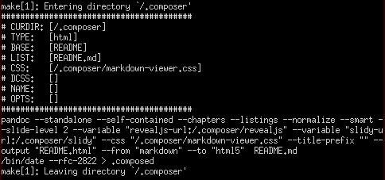

% Composer CMS: User Guide & Example File
% Gary B. Genett
% v2.0.beta5 (2015-04-02)

## Composer CMS
<!-- ############################################################### -->
[Composer]: #composer-cms


"Creating Made Simple."

* Homepage: [https://github.com/garybgenett/composer](https://github.com/garybgenett/composer)
* [License]

[License]: https://github.com/garybgenett/composer/blob/master/LICENSE.md
[Readme]: https://github.com/garybgenett/composer/blob/master/README.md

[Make]: http://www.gnu.org/software/make
[Pandoc]: http://www.johnmacfarlane.net/pandoc
[Markdown]: http://daringfireball.net/projects/markdown
[LaTeX]: http://www.tug.org
[GNU]: http://www.gnu.org
[Coreutils]: http://www.gnu.org/software/coreutils

[Wget]: https://www.gnu.org/software/wget
[Git]: http://www.git-scm.com

[Markdown Viewer]: https://github.com/Thiht/markdown-viewer
[Reveal.js]: https://github.com/hakimel/reveal.js
[W3C Slidy2]: http://www.w3.org/Talks/Tools/Slidy2

<!-- ########################### -->
## Contents
[Contents]: #contents

  * [Introduction]
    * [Overview]
    * [Quick Start]
    * [Goals]
  * [Details]
    * [Compatibility]
    * [Versioning]
    * [Dependencies]
    * [Caveats]

<!-- ############################################################### -->
# Introduction
[Introduction]: #introduction

<!-- ########################### -->
## Overview
[Overview]: #overview

[Composer] is a simple but powerful CMS based on [Pandoc] and [Make].
By default, input files are written in a variation of [Markdown].

Traditionally, CMS stands for Content Management System.  In the case of
[Composer], however, CMS really means a Content **Make** System.  For
many types of content, maybe even most, simpler is better.  Content is
very easy to manage when it lives its full life-cycle as plain text,
since there are a veritable multitude of solutions available for
tracking and managing text and source files.  What is really needed is
a basic system with advanced capabilities for "making" these simple text
files into richer, more capable document types.

This is the goal of [Composer].



<!-- ########################### -->
## Quick Start
[Quick Start]: #quick-start

[Composer] is completely self-documenting.  To get the full usage and
help output:

  * `make help`

To download/update some necessary 3rd party components:

  * `make update`

To build an example/test directory using all features:

  * `make test`

In the simplest case, [Composer] can be used to make the conversion of
[Markdown] files to other formats a trivial task.  The real strength and
goal of [Composer], however, is as a recursive build system for any type
of output content (websites, manuals/documentation, etc.).

The [Readme] and [License] also serve as example source files.

<!-- ########################### -->
## Goals
[Goals]: #goals

[Composer] is really nothing more than a [Make]-based wrapper to
[Pandoc].  The author started out with the following requirements for an
all-purpose documentation production system:

  * Minimal dependencies, and entirely command-line driven.
  * All source files in plain-text, and readable/usable as stand-alone
    documents, which means no inline syntax/formatting that is
    aesthetically displeasing or difficult to integrate/camouflage.
  * Clear isolation of content from formatting, so writing and
    editing/publishing tasks can be performed independently.
  * Relatively basic command-line syntax for producing "ad hoc"
    documents, regardless of the complexity of the source/output.
  * Scalable and recursive, so whole directories of information can be
    managed easily, with websites and large documents (books, manuals,
    etc.) being primary in mind.
  * Support for dependencies and inheritance, with global, per-tree,
    per-directory and per-file overrides.
  * Workflow agnostic, so it can be used by semi-technical team
    members in a corporate environment.
  * Professional output, suitable for business environments or
    publication.

While support for a multitude of output formats was desired, the
following were absolute necessities:

  * HTML
  * PDF
  * Presentation / Slideshow
  * DocX (completely negotiable, but valuable)
  * ePUB (somewhat negotiable, but highly desired)

A thorough review and test of the large number of available input
formats and formatting engines resulted in a very short list of projects
which could support the above requirements.  [Pandoc] was selected for
a number of reasons:

  * [Markdown] is an increasingly universal/portable and popular
    plain-text format.
  * Required formats worked "out of the box", and intermediary formats
    like [LaTeX] were almost completely abstracted.
  * Did not require any expertise with output or intermediary formats to
    accomplish advanced results/output.
  * Supported a large number of input and output formats, and was
    designed very intelligently to allow translation from any supported
    input format to any supported output format.
  * Internally, normalizes documents into a single data structure which
    can be manipulated or modified.
  * If necessary, all templates could be modified and the internal
    conversion could be scripted at a very deep level.

[Pandoc] provided the perfect engine, but running long strings of
commands was not feasible for quick and simple command-line use, and the
thought of writing new scripting/automation each time a large-scale
project emerged was not terribly exciting.  Thus, [Make] was selected as
a wrapping engine based on it's years of history as one of the most
popular and highly used source file processing systems in use.

The final result is [Composer], which leverages these two tools to
accomplish the original goals with a minimum amount of user knowledge
and expertise, and to provide a solid foundation for simplified
management of larger content production efforts.

<!-- ############################################################### -->
# Details
[Details]: #details

<!-- ########################### -->
## Compatibility
[Compatibility]: #compatibility

[Composer] is developed and tested on a Funtoo/Gentoo [GNU]/Linux
system.  An effort has been made to do things in a portable way, but
cross-platform development is not an area of expertise for the author.

Output of `make --version` on development system:

```
GNU Make 3.82
Built for x86_64-pc-linux-gnu
```

Output of `pandoc --version` on development system:

```
pandoc 1.12.3.3
Compiled with texmath 0.6.6, highlighting-kate 0.5.6.1.
```

If you discover issues, please contact the author directly, with advance
thanks.  It is highly desirable for [Composer] to be as "run anywhere"
as possible.

Running the commands in the [Quick Start] section will help you validate
whether your system will work as expected.  In particular, the `make
test` command validates the proper functioning of all the supported
features and uses of [Composer].

<!-- ########################### -->
## Versioning
[Versioning]: #versioning

[Composer] is not really revisioned into "releases" outside of the
source code repository.  Each commit is tested using `make test` first,
so the latest source should always be ready for production.

If you require greater assurance of stability, use a version of the
source that is tagged with a version number.

<!-- ########################### -->
## Dependencies
[Dependencies]: #dependencies

[Composer] was designed to have a minimum of external dependencies:

  * [Pandoc]
    * Also need some version of [LaTeX] installed
  * [Make]
    * [GNU] version is highly recommended (other versions may not work)
  * [Coreutils]
    * [GNU] version is highly recommended (other versions may not work)

In order to download/update the 3rd party components, such as style
sheets and formatters, these are also needed:

  * [Wget]
    * General-purpose HTTP/FTP retrieval tool
  * [Git]
    * Distributed version control system

Components from these 3rd party projects are used:

  * [Markdown Viewer]
    * Simple and elegant CSS for HTML files
  * [Reveal.js]
    * Beautifully slick HTML presentation framework
  * [W3C Slidy2]
    * Essentially the grandfather of HTML presentation systems

Basically, any [GNU]-based system, such as [GNU]/Linux, Cygwin or
FreeBSD (with the [GNU] tools installed), should work just fine.  The
biggest external dependency is [Pandoc] itself and the [LaTeX] system it
uses to produce some of the output formats (namely PDF).

<!-- ########################### -->
## Caveats
[Caveats]: #caveats

There are a couple important items to be aware of when using [Composer]:

  * Portability
    * Running it on non-Linux systems or with different versions of
      [Make] (see [Compatibility]) may not produce expected results.
    * Portability is a goal of the project, and it is written with
      standards compliance in mind, but it may very well depend
      specifically on the [GNU] version of [Make] despite this.
    * An effort has been made to anticipate file names with spaces or
      other special characters, but horribly named files may produce
      equally horrible results (this is generally the case with any
      file-based automation).
    * The "automagic" target detection uses a simple regular
      expression and is very basic.
  * Recursion
    * While it simplifies things quite a bit, it does not completely
      hide away the complexities of using [Make] recursively.
    * Recursion handling and the `$(COMPOSER_ABSPATH)` variable may be
      overly-clever and therefore not portable.
    * By default, recursion into sub-directories occurs after the
      current directory targets are run, which makes the output much
      more readable but precludes dependencies between parent
      directories and their children.
        * This behavior can be toggled globally or per-directory using
          the `$(COMPOSER_DEPENDS)` variable as documented.
    * There are some who have made good arguments that systems other
      than [Make] should be used for recursion.  This author concedes
      some of their points, but has chosen to ignore them and use the
      most widely deployed and used [Make] system available.
  * Variables
    * This system gives precedence to environment variables at the top
      level and in all the examples, which is key to making the
      inheritance behavior work.
        * If you wish to be insulated from this, you can make all the
          option variable definitions in children [Make] files explicit
          (use `override OPTS :=` instead of `override OPTS ?=`) and
          place them below the upstream `include` statements.
        * The side effect of this will be that each directory will need
          to define it's own behavior (i.e. no inheritance).
        * This solution is documented in `make help`, is tested and
          supported, and does not require any modifications to the main
          [Make] file.
    * Similarly to the above, the `export` command should not be used in
      any [Make] files read by [Composer], other than the provided
      examples in `make help` which have been tested.
  * Output
    * The `make help` output could be much more kind to those not
      working on huge terminal windows.

Finally, it could be that [Composer] introduces more complexity than it
does add value, which this author guesses is likely true for many.

The author encourages the reader to review the [Goals] section and
decide for themselves if [Composer] will be beneficial for their needs.

<!-- ############################################################### -->
<!-- End Of File -->
<!-- ############################################################### -->
