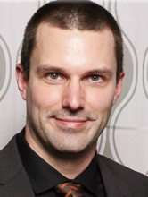

<!-- % Resume for Gary B. Genett -->
<!-- % Gary B. Genett -->
<!-- % v1.4 (2015-02-02) -->
<!-- ############################################################### -->

# Gary B. Genett

[Composer]: https://github.com/garybgenett/composer
[GaryOS]: http://sourceforge.net/projects/gary-os
[DWM multimon]: http://dwm.suckless.org/patches/multimon

+--------------------+----------------------------------------------------------------------------+
| Seattle WA, USA    | <http://garybgenett.net/resume.pdf> \| <me@garybgenett.net> \| 206-391-6606
+====================+===+
|                | * GNU/Linux (Funtoo/Gentoo, Debian)
| \ | * Scripting & automation (shell, Make, Perl)
|                    | * Performance & functional testing, development processes
|                    | * TCP/IP protocols & web applications, scalable architectures & virtualization
|                    | * F5 BIG-IP design, configuration & programming (TMSH, iControl, iRules)
|                    | * Systems integration & business requirements implementation
|                    | * Documentation: process, methodology, briefs & training
|                    | * Open source projects:
|                    |     * [Composer] -- simple but powerful CMS based on Pandoc and Make[^composer]
|                    |     * [GaryOS] -- an entire GNU/Linux system in a single bootable file[^gary-os]
| February, 2015     |     * [DWM multimon] -- contributed multi-monitor patches to DWM[^dwm]
+--------------------+---+

[^composer]: Composer on GitHub: <https://github.com/garybgenett/composer>
[^gary-os]: GaryOS on SourceForge: <http://sourceforge.net/projects/gary-os>

	Source code on GitHub: <https://github.com/garybgenett/gary-os>

[^dwm]: DWM multimon patches: <http://dwm.suckless.org/patches/multimon>

<!-- ########################### -->
## F5 Networks, Seattle WA

### New Product Introduction Engineer, 2009-Present
  * Business and technical interface between product management / product development and entire global services organization (consulting, training, knowledge and support teams)
  * Responsible for readiness of sales and services organizations with all new releases of products or services
  * Co-focal on one of F5s most significant BIG-IP releases (v11.0.0); focal for DSC/CMI, Plugins 2.0, vCMP, TMSH & iApps
  * Guided internal heuristics engine through initial stages to a maintainable and publicly available tool (iHealth)
  * Special projects go-to, including first two cross-departmental, cross-functional "think tank" projects: upgrades enhancement & operations guide
  * Pioneered video-based training format, decreasing cost and increasing value (higher retention in less time)
  * Consistent creator/presenter of scalability/internals sessions at both sales and services international conferences
  * On-site customer visits with account teams, acting as a corporate representative to close or keep business

### Field Systems Engineer (Technical Sales), 2007-2009
  * Assist with network architecture, planning, provisioning and operations through consultation, training, documentation, custom configurations and iRule development
  * Lead technical resource dedicated to Microsoft, directly supporting thousands of BIG-IPs and one of the world's largest application environments (MSN)
  * Facilitated triple in customer BIG-IP device count and quadruple in revenue with a double in account team
  * Delivered first two production deployments of revolutionary BIG-IP VIPRION chassis-based architecture: Xbox Live & BOSD
  * Wrote comprehensive BIG-IP monitoring integration documentation and training materials for 3rd party development team
  * Reverse-engineered and automated BIG-IP product installer to provide rapid provisioning
  * Ensured publicly acknowledged success with BIG-IP at MSNBC[^msnbc]

[^msnbc]: F5 MSNBC Case Study: <http://www.f5.com/pdf/case-studies/msnbc-election-day-cs.pdf>

	Archived for posterity: <http://garybgenett.net/resume/msnbc-election-day-cs.pdf>

### Product Management Engineer, 2004-2006
  * Expert-level knowledge of BIG-IP design, architecture and internals through hands-on testing and constant interaction with all levels of product development
  * Provide consultation and guidance to the executive team, product management, product development, services and sales in regards to company vision, product direction and inter-departmental processes, based on business and technical analysis of the marketplace
  * Competitive analysis, both business and technical, spanning the full range of market-awareness to specific feature differentiation, across competitors and products; maintain detailed briefing materials for use by executive team, product management and sales
  * First non-management member of team, helped define role and responsibilities
  * Initial performance testing, competitive analysis and development guidance integrating three acquisition products (FirePass SSL VPN, WebAccelerator and WANJet Optimization)
  * Authored performance testing guide, which remains the foundation for most comprehensive L4-L7 performance testing report in the industry[^performance]

[^performance]: F5 Performance Testing Guide: <http://devcentral.f5.com/downloads/f5/creating-performance-test-methodology.pdf>

	Archived for posterity: <http://garybgenett.net/resume/creating-performance-test-methodology.pdf>

	Comprehensive testing report (original): <http://garybgenett.net/resume/f5-performance-report-UPDATED.pdf>

	Comprehensive testing report (current): <http://www.f5.com/pdf/reports/F5-comparative-performance-report-ADC-2013.pdf>

### Network Support Engineer, 2004
  * Expert-level consultation and support for BIG-IP as single point of contact for internal and external customers
  * Utilize knowledge and industry-standard tools to rapidly familiarize with new environments and resolve incidents logically and efficiently
  * Diffuse heated situations and provide guidance; earn customer trust and ensure confidence in product/services
  * Identification of product defects and escalation to development in the form of actionable documentation
  * Built first shared lab environment and created web-based checkout system for global accessibility
  * Management go-to for situations requiring heightened attentiveness

<!-- ########################### -->
## MICROS Systems, Seattle WA

### Implementation Specialist, 2001-2004
  * Design and support mission-critical financial systems in a 24/7 environment
  * Hands-on management of customer expectations and experience from pre-sales to ongoing support
  * Directly responsible for largest deployments in Washington state; sole technician for UNIX-based systems
  * Increased revenue and customer loyalty by developing custom solutions using shell scripting, Perl, SQL and a proprietary scripting language

<!-- ############################################################### -->
###### exit(0);
<!-- ############################################################### -->
